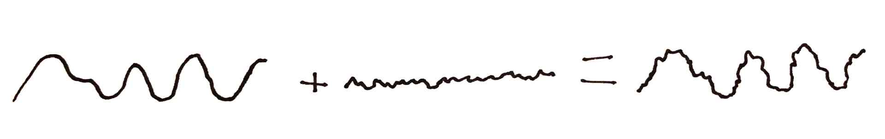

<script src="https://cdn.jsdelivr.net/npm/p5@1.4.0/lib/p5.js"></script>
<script src="/mess.js"></script>
<script src="./noise_mess.js"></script>

## Noise Generation

Random values are extremely common and important in procedural generation. Functions like `Math.random()` are the common go-to for choosing random values, but in many situations they are hard to work with. Psuedo-random number generators are designed to provide independent, unpredictable, and evenly-distributed values. If we want _related_ or _repeatable_ random values we have to do extra work. If we want random variation with specific aesthetic characteristics we also have to do extra work.

<div class="activity">

## Random Array

What if the `random()` function didn't exist? How could you modify this example to get the same effect using the provided `randomValues` array instead?



</div>

Noise functions are an alternative source of random values. Unlike the `random()` function, however, noise functions provide related, repeatable, and "good-looking" random variation.

There are several common noise functions, each with different characteristics. The most widely known noise function is probably [Perlin Noise](https://en.wikipedia.org/wiki/Perlin_noise), developed by Ken Perlin while working on visual effects for the amazing 1982 motion picture [_Tron_](http://www.imdb.com/title/tt0084827/). Ken later developed a similar but faster version called [simplex noise](https://en.wikipedia.org/wiki/Simplex_noise). Other noise functions include [Worley noise](https://en.wikipedia.org/wiki/Worley_noise), developed by Steven Worley, and the simpler [value noise](https://en.wikipedia.org/wiki/Value_noise).

<div class="three-up wide">


Perlin Noise{scale}


Worley Noise{scale}


Value Noise{scale}

</div>

Noise functions provide a "cloud" of random values that can be used in a wide variety of ways. Noise functions are frequently used in procedural texture generation and terrain generation, but their applications are not at all limited to those areas. Noise functions can be thought of as a lookup table of pre-generated random values that can be used in place of `random()` in many cases. Noise functions are particularly well suited to adding small variations to create a more natural feeling output.





## Noise vs. Random

<div class="callout">

{scale}

</div>

Consider the code you would write to draw the blue squares above. You would need to provide several values for each square: horizontal position, vertical position, width, height, and color.

Where do those values come from? They could come from a few places.

| Source     | Purpose                                                         |
| ---------- | --------------------------------------------------------------- |
| Hard Coded | You always want the same, specific value.                       |
| Parameters | You want to be able to control the value from a larger context. |
| random()   | You want random variation.                                      |
| noise(x)   | You want random—but controlled—variation.                       |

Both `random()` and `noise()` provide a source of variation, but `noise()` provides much more control. The values from `random()` the sizes of the boxes won't be related at all. With `noise()` we can control how quickly the size changes horizontally, vertically, and over time. If we sample a small area of the noise function the variation will be subtle and gradual. If our samples are far apart the variation will be be drastic, unpredictable and look a lot like `random()`.

#### Random()

This example draws a big circle, and a line of smaller circles. Variation is created with the `random()` function, which allows control over the amount of variation, and global (and fragile) repeatability via the random seed.



#### Noise(x)

This example uses the `noise()` function to create variation. It control over the amplitude, frequency, and character of the variation. It also provides independent (and robust) repeatability.



Compare the code and results of the two examples above.

| random()                                                                                                                                                      | noise()                                                                                                                                       |
| ------------------------------------------------------------------------------------------------------------------------------------------------------------- | --------------------------------------------------------------------------------------------------------------------------------------------- |
| It's easy to control the range of values provided by `random()`.                                                                                              | It is also easy with `noise()`.                                                                                                               |
| The values provided by `random()` are independent and unrelated. The circles change size at high frequency and with no transition.                            | The values provided by `noise()` are arranged spatially. The frequency of size changes can be controlled and smooth transitions are natural.  |
| Repeatable results can be achieved with `randomSeed()`, but the effect is global and fragile. You have to freeze the big circle and the circle line together. | Achieving repeatable results with `noise()` is more flexible. You can freeze the circle line without changing the behavior of the big circle. |
| Good                                                                                                                                                          | Great                                                                                                                                         |

## Benefits of Noise

### Noise Looks Good

The p5 `noise(x)` function returns values sampled from Perlin Noise. Perlin Noise provides random values with a particular aesthetic arrangement. The variation in Perlin Noise is band-limited: the frequency of values is predictable and even, without flat or noisy areas. The variation is also visually isotropic: it looks the same at different rotations. These characteristics make it a useful basis for many applications that require natural-feeling variation.

Other noise functions—like Worely and Value Noise—offer different aesthetic qualities, and it is quite possible to create your own noise function that looks the way you want. Most of the time you don't _need_ to create your own noise function to get a particular look. You can tweak the aesthetics of a noise functional by manipulating its values with math. The [Terrain from Noise](https://www.redblobgames.com/maps/terrain-from-noise/) article on Red Blob Games is a good place to see some common techniques for shaping noise.

### Noise is Repeatable

Noise functions take one or more coordinate arguments. These arguments specify a location in the noise cloud and the function returns the value found at that location.

This makes getting repeated results easy: every time you call `noise(x)` with a particular argument, you get the same value back. This can be very useful. For example, in an animation you often need a value to stay the same from frame to frame.

- `random()` _does not accept_ coordinate arguments and returns a different random value every time.
- `noise(x)` _requires_ an coordinate argument and returns the same random value every time it is called _with that argument_.

<div class="callout">

This difference is the core reason why `noise(x)` is so useful AND the core reason it can be confusing at first. Learning what values to pass to `noise()` takes some practice.

</div>

### Noise is Controllable

By controlling what you pass to `noise(x)`, you can control the frequency of change in the returned values. This can be used to control how quickly values vary in space and time. With p5s Perlin Noise, you can also adjust the character of `noise(x)` using `noiseDetail()`. You can scale and shift the values returned from `noise(x)` to the range you need in the same way you shift values from `random()`.

### 1D Noise Example



### 1D, 2D, + 3D Noise

Many noise functions are multidimensional. The noise function in most programming libraries can take 1, 2, 3, or even more parameters. You can think of these parameters as specifying a multidimensional address in a "cloud" of values.

`noise(x)`


`noise(x, y)`


`noise(x, y, z)`


## Building Noise Functions

The `noise()` function models an infinite cloud of predetermined random values. When you call `noise(x)`, you are asking for the value in the cloud at the coordinate `x`. To create a noise function you need to build two things:

1. a way to associate random values with each integer coordinate in the cloud
2. a way to interpolate between these values if fractional coordinates are requested.

Different noise functions solve these problems in different ways.

<div class="activity">

## Building 1D Noise

How does the `noise(x)` function work? Explore the underlying concepts by building a simplified noise function with pencil&nbsp;and&nbsp;paper.

### Part 1: Simple Noise

- Roll 1d12 for each square on the sheet and plot the value on the graph.
- Connect the plotted points with straight lines.
- According to your hand-made noise function, what is the value of `noise(3)`, `noise(4)`, and `noise(6.5)`?

### Part 2: Custom Noise

- Discuss strategies for populating the values. Populate each square on the graph and plot the values.
- Discuss strategies for interpolating the values. Connect the plotted points using your interpolation strategy.
- According to your hand-made noise function, what is the value of `noise(3)`, `noise(4)`, and `noise(6.5)`?

<div class="link-box">

<a href="../handouts/1d_noise_graph.svg" download>**1d_noise_graph.svg** Worksheet</a>

<a href="../handouts/1d_noise_graph.ai" download>**1d_noise_graph.ai**Worksheet</a>

</div>

</div>

## Working with Noise

### Calling the Noise Function

The `noise()` function takes up to three parameters: `noise(x,y,z)`. These parameters allow you to request values arranged in a three dimensional "cloud" of pseudo-random values.

When you call `noise(x)` you have to pass in at least one parameter. This parameter specifies the location in the cloud of the value to return. You can think about `noise(x)` as a lookup table: `noise(1)` provides one value in the table and `noise(2)` provides another.

Choosing appropriate parameter values takes some getting used to. You can pass in `frameCount` or `millis()` to get values that change over time. You can pass in XYZ coordinates to get values that change over space. These are very common cases, but really you can pass values from any range into `noise()` and it will provide random values in return.

### Controlling the Frequency

You can control the frequency of returned values by scaling the values you pass in for `x`, `y`, and `z`.

```javascript
// get a value that changes over time
n = noise(seconds);

// get a value that changes over time more slowly
n = noise(seconds * 0.1);

// get a value that changes over time more quickly
n = noise(seconds * 10);
```

### Controlling the Amplitude and Range

Noise functions typically return values in the range of 0 to 1. Use multiplication and addition to shift values to the range you need. Be aware that while `random()` provides evenly-distributed values, noise values are biased towards the middle. Also check the documenation for your noise function to understand the range it provides. In p5.js the range will differ depending on how you have configured it with `noiseDetail()`.

```javascript
// scale values to sit between 10 and 20;
n = noise(frameCount) * 10 + 10;
```

You could also use `map()`:

```javascript
// map noise(frameCount) from the range [0,1) to the range [10 to 20)
n = map(noise(frameCount), 0, 1, 10, 20);
```

### Controlling the Detail

The [noiseDetail()](https://p5js.org/reference/#/p5/noiseDetail) function allows you to control the "roughness" or "detail" of the noise returned. Detailed noise is achieved by adding layers of noise together.



Typically, each layer of noise is twice as detailed (higher frequency) and half as prominent (lower amplitude). These layers are sometimes refered to as "octaves" because their frequncies double each time, like musical octives.

### Controlling the Seed

By default, every time you restart your sketch the noise cloud is regenerated with a randomized seed. The [noiseSeed()](https://p5js.org/reference/#/p5/noiseSeed) allows you to manually set the seed used for the noise cloud. This allows you to get the same values from `noise()` after restarting your sketch.

## Study Examples

The following study examples demonstrate using noise to introduce variation. Compare these examples to their counterparts in the [Random Values](../random) chapter.

### Skyline

Using noise to determine the height of the buildings creates a skyline with tall and short buildings clustering together.



### Circle Grid

This example draws circles of varying sizes. Explore how passing different values to `noise()` impacts what is drawn.



### Grass

Using noise to control the lean of each blade of grass leads to a nice, natural-looking wind effect.



<div class="activity challenges">

## Coding Challenges

Explore the study examples above by completing the following challenges.{intro}

### Modify the Circle Grid Example

1. This example shows several ways to map noise. Comment in and out each example, and compare the results. `•`

### Modify the Grass Example

1. Study the code and get a general idea of how it works. `•`
1. Line 28 has two magic constants: `.01` and `.001`. Try changing the first constant to `.1`. What happens? What happens when you change it to `1`? `•`
1. Set the first constant back to `.01`. Change the second constant to `.01`. What happens? `•`
1. Add flowers to some of the blades of grass. `•••`
   {continue}

### Modify the Skyline Example

1. This example has two global parameters: `amplitude` and `frequency`. Change the values of these parameters to get a feel for how they affect the output. What happens when you use a very small value for frequency, such as `.001`? `•`
1. On line 23, what would happen if you changed `noise(x * frequency)` to `noise(x * frequency, frameCount)`? Make the change. Is that what you expected? `•`
1. Your last change should have caused the bar heights to animate very quickly. Slow down the rate of change. `••`
1. Add water towers to some of the buildings. `•••`
   {continue}

</div>

<div class="assignment">

## Keep Sketching!

### Sketch

This week, focus on using the `noise()` function. Use `noise()` in a variety of ways. Use 1D, 2D, and 3D noise. Try using high, mid, and low frequency noise. Try using noise to control different things: position, size, color, rotation, etc. Think about tile graphics, `random()`, and parameters while you work. Consider combining these concepts with `noise()`.

### Challenge: Treasure Map

Make a program that generates treasure maps.

#### Your maps should

- Describe the geography of a fictional territory
- Mark the location of the treasure
- Include a path to the treasure from a reference point (optional)
- Be expressed in a cohesive style

#### Things to consider

- Where is your treasure? On a tropical island? On a farm? In a warehouse?
- What style is your map? Is it old and beaten? Sci-fi?
- Does your map include labels? What do they say?
- Can you make a believable natural geography? Should you?
- What terrain features might you include? Rivers? Mountains? Hills? Boxes?
- It is okay if your map takes seconds or even minutes to generate.
- A map can represent many things—it doesn't necessarily need to represent geography.

<!-- #### When posting your map

- Include three maps generated by your program.
- Each map should be shown as an image, not a video.
- Consider posting a first run at this challenge early in the week, and then revisiting it towards the end of the week with a second post. -->

### Pair Challenge: Layer Tennis

#### Part 1

1. Create a computationally generated image.
2. Pass the image—not the code—to your partner.

#### Part 2

1. Receive a computationally generated image from your partner.
2. Create a computationally generated image in response.
3. Composite your image and their image using an image editing software and share the result.

</div>

## Explore

<div class="link-box">

[**Noise Functions and Map Generation** redblobgames.com](https://www.redblobgames.com/articles/noise/introduction.html)
Interactive article on creating and using noise functions.

[**Noise** Book of Shaders](https://thebookofshaders.com/11/)
Chapter on using noise in GLSL shaders from the excellent _The Book of Shaders_.

[**2D Noise** The Coding Train](https://www.youtube.com/watch?v=ikwNrFvnL3g)
: Daniel Shiffman's video on 2D Perlin Noise in p5.js

[**Noise and Turbulence** Ken Perlin](http://mrl.nyu.edu/~perlin/doc/oscar.html)
Comments on Perlin Noise direct from the source, including the code.

[**Improved Perlin Noise** GPU Gems](https://developer.nvidia.com/gpugems/GPUGems/gpugems_ch05.html)
Ken Perlin details an improved implementation of Perlin Noise for [GPU Gems](https://developer.nvidia.com/gpugems/GPUGems/gpugems_pref01.html)

[**Juicing your Cameras With Math** GDC Tech Talk](https://www.youtube.com/watch?v=tu-Qe66AvtY)
GDC talk on making cameras cooler. At 11:40 he discusses the benefits of using Perlin Noise instead of RNG for camera shake.

[**Noise in Creative Coding** Vuran Vachhar](https://varun.ca/noise/)
A full discussion of noise with interactive demos.

[**The Renderig of INSIDE** Playdead Devs](https://www.youtube.com/watch?v=RdN06E6Xn9E)
A great developer talk covering the graphics techniques in INSIDE.

</div>
