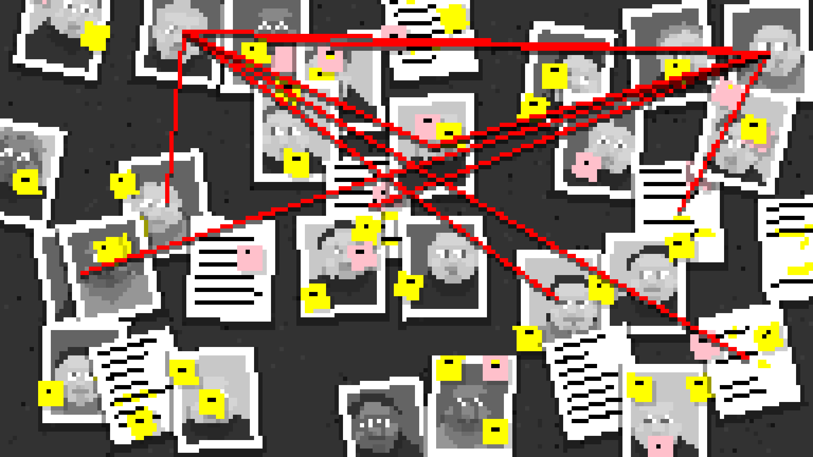

<script src="https://cdn.jsdelivr.net/npm/p5@1.4.0/lib/p5.js"></script>
<script src="/mess.js"></script>
<script src="./faces_mess.js"></script>

## The Methodical Application of Chance

We use the word _random_ to mean an hodgepodge of related ideas. Depending on context, we might mean unplanned, unexpected, unpatterned, uncontrolled, unbiased, or unpredictable. Each of these are important characteristics in many procedural systems. Randomness is a staple of procedural generation systems, and careful control of randomness is important to balancing chance and control.

<div class="sidebar link-box">

[**_Instructions..._** Interactive Demo](http://www.buschs.de/Mozart/Mozart.html)

[**_Instructions..._** Original Score](<https://imslp.org/wiki/Musikalisches_W%C3%BCrfelspiel,_K.516f_(Mozart,_Wolfgang_Amadeus)#IMSLP20432>)

[**_Musikalisches Würfelspiel_** wikipedia.org](https://en.wikipedia.org/wiki/Musikalisches_W%C3%BCrfelspiel)

</div>

As an example consider the 18th-century composition _Instructions for the composition of as many waltzes as one desires with two dice, without understanding anything about music or composition_, which [may](https://en.wikipedia.org/wiki/Musikalisches_W%C3%BCrfelspiel) have been written by Mozart. Rather than a fixed score, _Instructions_ is a collection of pre-composed musical phrases a set of rules for using dice to select and order the phrases to create a unique composition. By leaving some aspects to chance while controlling others, the system ensures that each variation makes musical sense.

Using random values in your procedural system doesn't mean your results must be haphazard, uncontrolled, or unorganized. While individual random values are unpredictable, with planning you can use these values to create a coherent cumulative effect.





<div class ="discussion">

## Control vs Chance

Consider the selected works above.

- Which aspects of each work were influenced by chance?
- Which aspects were controlled by the artist?

</div>

## Random Numbers and Dice

Most programming languages provide a function for generating random numbers. Usually the values provided are evenly distributed over the range 0 to 1. Mapping these values to your desired ranges and baising their distribution are fundemental skills.

### Generating Random Numbers

Plain Javascript provides `Math.random()` to generate a random number.

> The Math.random() function returns a floating-point, pseudo-random number in the range [0, 1); that is, from 0 (inclusive) up to but not including 1 (exclusive), which you can then scale to your desired range. The implementation selects the initial seed to the random number generation algorithm; it cannot be chosen or reset by the user.
>
> [MDN Documentation](https://developer.mozilla.org/en-US/docs/Web/JavaScript/Reference/Global_Objects/Math/random){attrib}

### Specifying a Range

`Math.random()` always gives you a value between 0 and 1. If you want a different range, you can scale and offset the value yourself:

```javascript
random() * range + start;

// e.g. even distribution between [10 and 15)
random() * 5 + 10;
```

### Random Integers

The `Math.random()` function returns floating point values, but sometimes you just want integers. The `Math.floor()` function will round a number down.

```javascript
// roll a standard die
Math.floor(Math.random() * 6) + 1;
```

Be careful when generating integers: it is easy to get results that are slightly off. `Math.floor()` rounds down to the nearest integer, so you need to have values that go _above_ the highest integer you want returned.

Using `Math.round()` instead of `Math.floor()` can lead to unevenly distributed results. In the example below, `1` will get picked half as often as it should, and `7` will sometimes get picked though it should not.

<div class = "bad">

```javascript
// roll a standard die
// this won't quite work. why?
Math.floor(Math.random() * 7);

// this also doesn't quite work. why?
Math.round(Math.random() * 6) + 1;
```

</div>

### Creating a Utility Function

The expressions above are already getting complicated enough to negatively impact readability. Look at the code below. How quickly can you determine the minimum and maximum value that might be assigned to `strength`? How confident are you?

```javascript
let strength = Math.floor(Math.random() * 6) + 10;
```

One way to improve the readability of this code is to create and use utility function.

```javascript
let strength = randomInt(10, 15);

// return a random integer between min and max (inclusive)
function randomInt(min, max) {
  return Math.floor(Math.random() * (max - min + 1)) + min;
}
```

The `randomInt()` function above returns a random integer between min and max, inclusively. This is different from `random()`, which returns values exclusive of max. I decided to design the function to work this way because I felt it was more natural to be inclusive for whole numbers, as in the phrase "pick a number between 1 and 10" which is generally understood to be inclusive.

### p5 `random()`

Processing provides the `random()` function for generating random numbers. If called without any parameters, `random()` works very much like `Math.random()` producing numbers in the range [0, 1).

```javascript
console.log("random()"); // random()
console.log(random()); // 0.45...
console.log(random()); // 0.12...
console.log(random()); // 0.37...
```

P5's `random()` function accepts optional parameters to control the range of the number, so you don't have to do it yourself.

```javascript
console.log("random(10)"); // random(10) -> range [0, 10)
console.log(random(10)); // 4.89...
console.log(random(10)); // 1.20...
console.log(random(10)); // 6.99...

console.log("random(20, 30)"); // random(20, 30) -> range [20, 30)
console.log(random(20, 30)); // 21.96...
console.log(random(20, 30)); // 20.56...
console.log(random(20, 30)); // 22.36...
```

P5 provides `floor()` which you can use to generate random integers.

```javascript
// roll a standard die
floor(random(0, 6)) + 1;
// or
floor(random(1, 7));
```

<div class="bad">

```javascript
// this won't quite work. why?
floor(random(1, 6));
```

</div>

### Biasing the Distribution

The `random()` function produces results that are appoximately [uniformly distributed](https://en.wikipedia.org/wiki/Continuous_uniform_distribution): all values are equally likely.

Sometimes, uniform distribution is exactly what you want. If you are randomly choosing who gets go first in a game, all the players should have an equal chance.

Other times, uniform distribution isn’t what you really want. If you are drawing a forest scene, you might want mostly short trees, some middle-height trees, and only a few very tall trees.

<div class="sidebar link-box">

[**Dice Calculator** anydice.com](http://anydice.com/)

</div>

With some math, you can reshape the values returned by `random()` to just about any distribution you can think of. Often, you won't need anything very complicated. Just biasing the results towards the low end, high end, or middle is often enough to achieve appealing effects. The calculations for creating these types of distributions is easy enough that you'll often see them used as [mechanics](https://roleplayersrespite.com/5e-advantage-disadvantag) in table top rollplaying games without the need for a computer.

<div class ="activity">

## 2d6 vs 1d12 Chart

Compare the outcomes of rolling 2 6-sided dice to rolling 1 12-sided die.

### Chart One

1. Roll two six-sided dice 50 times.
1. Plot the sums.

### Chart Two

1. Roll a twelve-sided die 50 times.
1. Plot the values.

<div class="link-box">

<a href="../handouts/dice_chart.svg" download>**dice_chart.svg**Worksheet</a>

</div>

</div>

#### Uniform Distribution

Generally random functions provide uniform distribution. You don't need to do anything if that is what you want.

```javascript
randomInt(1, 10);
```

{callout scale}

Try `1d10` on [anydice.com](https://anydice.com/program/215)

#### Low Bias

Taking the lowest of two or more random numbers will bias the result toward the low end. The p5 `min()` or JavaScript `Math.min()` function returns the lowest value among the provided arguments.

```javascript
min(randomInt(10), randomInt(10));
```

{callout scale}

The more random numbers you compare, the stronger the bias. Both the p5 and JavaScript `min()` function can accept as many arguments as you want.

```javascript
min(randomInt(10), randomInt(10), randomInt(10), randomInt(10));
```

{callout scale}

Try `[lowest 1 of 5d10]` on [anydice.com](https://anydice.com/program/24a0a)

#### High Bias

Taking the highest of two or more random numbers will bias the result toward the high end. The p5 `max()` or JavaScript `Math.max()` function returns the lowest value among the provided arguments. Like the low bias example, the more random numbers you compare, the stronger the bias.

```javascript
max(randomInt(10), randomInt(10));
```

{callout scale}

Try `[highest 1 of 2d10]` on [anydice.com](https://anydice.com/program/2778)

#### Middle Bias

Averaging two or more random numbers will bias the result toward the middle.

```javascript
(randomInt(1, 10) + randomInt(1, 10)) / 2;
```

{callout scale}

Try `2d10 / 2` on [anydice.com](https://anydice.com/program/24a0c)

#### Normal Distribution

If you generate three or more random numbers and average them, the results approach a [normal distribution](https://en.wikipedia.org/wiki/Normal_distribution). Normal distribution, or Gaussian distribution, is the "bell curve" distribution which is often found in natural systems. It occurs when multiple independent chances [combine](https://en.wikipedia.org/wiki/Central_limit_theorem). For example, many factors contribute to how fast a tree may grow, so we might expect tree heights—in one area, for trees of the same age—to follow a normal distribution.

```javascript
(random(1, 11) + random(1, 11) + random(1, 11)) / 3;
```

{callout scale}

Try `3d10` on [anydice.com](https://anydice.com/program/1437)

<div class="callout">

P5 provides a function called [randomGaussian()](https://p5js.org/reference/#/p5/randomGaussian) for generating numbers fitting a specific normal distrution with a given mean and deviation. With `randomGaussian()` the possible values have a infinite range but extreme outliers are very rare.

</div>

## Random Orders and Decks

<div class="sidebar link-box">

[**Birthday Paradox** wikipedia.org](https://en.wikipedia.org/wiki/Birthday_problem)

</div>

The `random()` function works a lot like rolling a die.
When you roll a die, you get random values. Each value should be equally probable and each roll should be [independent](<https://en.wikipedia.org/wiki/Independence_(probability_theory)>).
If you roll the die multiple times, you **might get the same value more than once**, and it **might take a long time to get a particular value**.

<div class="sidebar link-box">

[**Birthday Paradox** wikipedia.org](https://en.wikipedia.org/wiki/Birthday_problem)

</div>

These types of effects can be counter-intuitive and sometimes aesthetcially undesireable.

If you roll a normal die six times, it is unlikely—_about a 1.5% chance_—that you’ll get all six values without repeats. You have a pretty good chance—_about 33%_–of not rolling any 1s. You can be pretty sure—_98.5% sure_—that at least one number won’t have appeared after six rolls.

A deck of cards works differently. When you pull cards from a deck, you don't get _random values_ you get _values in a random order_. You avoid duplicates, and you know you will have toured all the values when you reach the end of the deck.

### Modeling a Deck with an Array

p5 provides the [shuffle()](https://p5js.org/reference/#/p5/shuffle) function to randomly reorder the elements in an array. By using `shuffle()` we can simulate shuffling a deck, pulling values from it, and reshuffling when we run out.

```javascript
// create an array to hold the possible values
var values = [0, 1, 2, 3, 4, 5, 6, 7, 8, 9];

// create a variable to hold the current position in the deck
var position = 0;

function setup() {
  // shuffle the deck first
  values = shuffle(values);

  // pull as many values as we need
  for (let i = 0; i < 50; i++) {
    console.log(valueFromDeck());
  }
}

function valueFromDeck() {
  // find the value at the current position in the deck
  var v = values[position];

  // change the position for next time
  position++;

  // if that was the last value, shuffle and start over from the top
  if (position == values.length) {
    values = shuffle(values);
    position = 0;
  }

  // return the value
  return v;
}
```

### Dice Visualizer

This visualizer simulates rolling a 10-sided die. It chooses a random value every time you click and plots a histogram of the results. The expected distribution is uniform. In practice if you roll a few dozen times, you are likely to see some numbers come up much more often than other numbers. After hundreds or thousands of rolls the results should even out.



### Deck Visualizer

This visualizer simulates choosing numbers from a deck with 10 cards. It pulls the top card every time you click. When the deck runs out, it is shuffled. Using a deck ensures that the numbers come up very evenly, though the order is random.



<div class="activity">

## Skyline Tactic Match

Visualize different tactics for choosing and biasing random values.

Study the example city skylines below. Each skyline was made using a different tactic for picking random values. Match each skyline to its corresponding tactic.

### Skylines

{scale}

{scale}

{scale}

{scale}

{scale}

### Tactics

Pure Random, Low Bias, Normal Bias, High Bias, Deck

### Discuss

- Which tactic is the "best"?
- When would you choose to use different types of bias?
- Where is each type of bias found in the world?

</div>

## Random Choices

If you want your code to make a decision at random, you can combine `random()` with a conditional—`if`—statement.

```javascript
// do something only half the time
if (random() < 0.5) {
  console.log("Optional Thing");
}

// do something only 10% of the time
if (random() < 0.1) {
  console.log("Rare Thing");
}

// another way to do something only 10% of the time
if (random(100) < 10) {
  console.log("Rare Thing");
}
```

With `else` you can pick between two options and guarantee that one or the other will happen.

```javascript
// do one thing, or the other. even odds.
if (random() < 0.5) {
  console.log("Option A");
} else {
  console.log("Option B");
}
```

With `else if` you can pick between multiple optional things to do.

```javascript
var r = random(100);

if (r < 20) {
  // r is < 20
  console.log("Rare Thing 1 (20%)");
} else if (r < 40) {
  // r is >= 20 and < 40
  console.log("Rare Thing 2 (20%)");
} else {
  // r is >= 40
  console.log("Common Thing (60%)");
}
```

A common mistake when following this pattern is calling random multiple times. If you are making one choice between several options, you only want to call `random()` once.

<div class="bad">

```javascript
// this code doesn't work as expected
if (random(100) < 20) {
  // Actually a 20% chance
  console.log("Rare Thing 1 (20%)");
} else if (random(100) < 40) {
  // Actually a 32% chance
  console.log("Rare Thing 2 (20%)");
} else {
  // Actually a 48% chance
  console.log("Common Thing (60%)");
}
```

</div>

## Pseudo-random vs. Random

Computers are deterministic systems. When a computer is in a particular state and performs a specific instruction, the resulting state should always be the same. The results are never random.

So how can `random()` produce a random value? Technically, it can't and it doesn't. It produces values that _appear to be random_, called [pseudorandom values](https://en.wikipedia.org/wiki/Pseudorandomness). Pseudorandom values appear random but are created by a deterministic process.

A common method to create pseudorandom values is a [Linear Congruential Generator](https://en.wikipedia.org/wiki/Linear_congruential_generator). LCGs begin with an initial value called the **seed**, then use multiplication, addition, and modulus (remainder after division) to derive a new, seemingly random value. It is important to understand that the sequence of `random()` numbers is perfectly predictable if you know the seed.

<div class="activity">

## Pencil + Paper LCG

Generate pseudo-random values by hand.

The Linear Congruential Generator Algorithm is simple enough that you can execute it by hand. This is a good way to get a feel for how an LCG works, and how simple arithmetic can be used to create a pseudorandom sequence.

### Instructions

1. Enter your assigned seed in the top box.
2. Follow the arrows, perform the indicated operations, and put each result in the following box.

<div class="link-box">

<a href="../handouts/lcg_random.svg" download>**lcg_random.svg**Worksheet</a>

</div>

</div>

### Toy Linear Congruential Generator

Below is a very basic implementation of an LCG, using small numbers that are easier to reason about. This code follows the same algorithm as the pencil + paper activity above.



### Setting the Random Seed

P5 provides [randomSeed()](https://p5js.org/reference/#/p5/randomSeed) to set the **seed** used by `random()`. Once you have set the seed, the sequence of values produced by random will always be the same.

The following code example sets the random seed to `12` and then generates 3 random numbers. The results are predictable, and the expected values are shown in the comments. If you change the seed to any other value, you'll get a different series.



If you set a seed you can use random values in your code but get the same results each time you run your program. This can be a useful feature in some programs and can help with debugging problems. For example, Minecraft creates its worlds procedurally. You can provide a seed for the algorithm to use when making random decisions. If start two games with the same seed, you'll get the same world both times.

Be careful when using a seed with `random()` to get a repeatable sequence. There are at least two common ways for things to get messed up.

- First, if you change your program and add or remove a call to `random()`, you will alter the position in the sequence for the following calls.

- Second, if your program accepts user input, and that input can influence how many times `random()` is called, your program can also get off sequence.

<div class="callout">

The Javascript does not provide any way for you to set the seed used by `Math.random()`, so if you need to set the seed and are not using p5, you'll need to find and use another Javascript library for generating random numbers.

</div>

## Study Examples

The following study examples demonstrate different ways to bias and map random values to get different looks and effects. Carefully study each example to understand how it works. Several of the examples offer varied approaches which can be commented in and out to compare their results.

### Skyline

This is the code used to generate the abstract skyline images from the Skyline activity above. The height of each building is determined by the `pickHeight()` function.



### Circle Grid

This example draws a grid of randomly-sized circles. Try commenting in the different methods for choosing the size of each circle. Each method has a distinct look.



### Grass

This example draws a row of lines. The height and lean of each line is chosent at random to create a natural, grass-like appearance.



### Brownian Motion

This example simulates [brownian motion](https://en.wikipedia.org/wiki/Brownian_motion), which describes the random paths of particles in a liquid or gas. Brownian motion is a [common](https://www.youtube.com/watch?v=XUA8UREROYE) [theme](https://pbat.ch/proj/monolith/wiki/fbm/) in creative coding.



### Horizon

This example draws a simple landscape using geometric shapes. It defines functions that draw trees, bushes, and houses, and uses `random()` to decide what to draw in each position.



<div class="activity challenges">

## Coding Challenges

Explore the study examples above by completing the following challenges.{intro}

### Modify the Circle Grid Example

1. Change the background color to dark grey. `•`
1. Change the circle color to white. `•`
1. Draw each circle filled with a randomly-chosen color. `•`
1. Draw each row with a randomly-chosen color. `••`
1. Draw each column with a randomly-chosen color. `•••`

### Modify the Grass Example

1. Make the grass taller. `•`
1. Make the grass green. `•`
1. Make the grass messier. `•`
1. Make each blade of grass with a randomly-chosen shade of green. `••`
1. Make the short blades of grass darker than the tall ones. `•••`
   {continue}

</div>

## Project Case Study: Conspiracy Board



Conspiracy Board is a program that generates pixel-art style collage of documments, portraits, and strings. It is written in Javascript using the p5.js library. Visit the case study to learn how it works.

<div class="link-box">

[**Conspiracy Board** Case Study](./conspiracy_board/index.html)

</div>

<div class="assignment">

## Keep Sketching!

### Sketch

Experiment with procedurally generating images using `random()`. Explore each of the tactics discussed above.

### Challenge: Master Study

Kasimir Malevich, Mark Rothko, Piet Modrian, and Anni Albers all worked with basic shapes, color, and natural media. Create a sketch that generates new works in the style of one of these artists. Pay particular attention to the subtleties and textures of your chosen artist's work. How closely can you recreate these subtleties?

### Pair Challenge: Deck

Working with a partner, create a sketch that generates random images. ALL random images should be generated using the deck tactic discussed above. Work together in the same (real or virtual) place and time on the same code.

</div>

## Explore

<div class="link-box">

[**Random.org** True RNG](https://www.random.org/)
A true random number generator that uses atmospheric noise as a source of randomness.

[**LavaRand** Cloudflare](https://blog.cloudflare.com/lavarand-in-production-the-nitty-gritty-technical-details/)
Cloudflare uses lava lamps as a source of randomness for encryption.

[**Two Types of Random in Game Design** Game Maker's Toolkit](https://www.youtube.com/watch?v=dwI5b-wRLic)
Mark Brown discusses how game designers use randomness.

[**Multiple Articles** anydice.com](https://anydice.com/articles/)
Series of articles on dice mechanics and probability.

[**Damage Rolls** Redblob Games](https://www.redblobgames.com/articles/probability/damage-rolls.html)
Interactive article on shaping distributions.

[**Gallery of Distributions** Engineering Statistics Handbook](https://www.itl.nist.gov/div898/handbook/eda/section3/eda366.htm)
A great entry point if you want a technical deep dive on distributions.

[**Chance vs. Randomness** Stanford Encyclopedia of Philosophy](https://plato.stanford.edu/entries/chance-randomness/)
Essay on the subtle distinction between chance and randomness.

</div>
