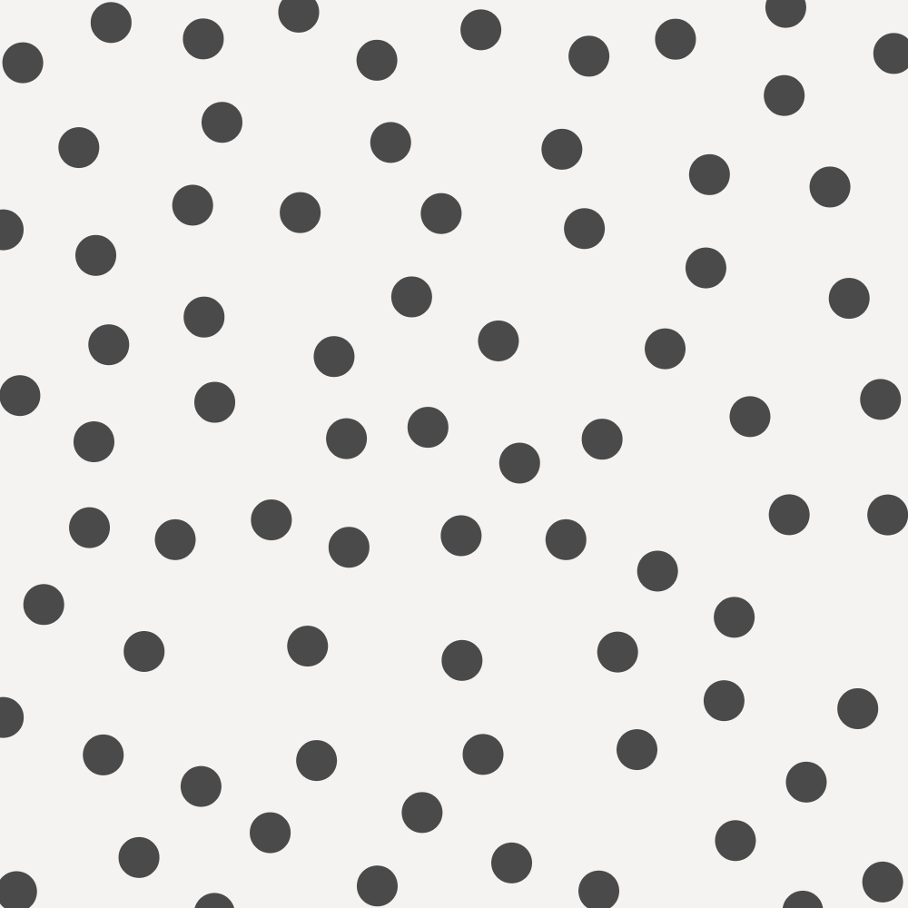

<script src="https://cdn.jsdelivr.net/npm/p5@1.3.1/lib/p5.min.js"></script>

<script src="/mess/strat_mess.js"></script>

## Computational Form + Strategies + Tactics

> Strategy without tactics is the slowest route to victory. Tactics without strategy is the noise before defeat.
>
> [Probably not Sun Tzu](https://en.wikiquote.org/wiki/Sun_Tzu){attrib}

<style>
canvas {
   image-rendering: pixelated;
}
</style>

So far we've been looking at low-level topics like how to use—and get the most from—`random()` and `noise()`. In the chapter, the focus is on the high-level structure of a program. To create more complex systems you must develop a clear understanding of your goal and create a plan to achieve that goal, divide that plan into sub-problems ([decomposition](<https://en.wikipedia.org/wiki/Decomposition_(computer_science)>)) and create code to solve those sub-problems ([implementation](https://en.wikipedia.org/wiki/Implementation)).

When planning and coding a project, I tend to think in terms of _strategies_ and _tactics_.

#### Strategies

Strategies are high-level plans for achieving your unique, broad goals. Because strategies are specific to their goals they are not highly reusable.

_Strategies are composed of tactics._

#### Tactics

Tactics are low- to mid-level concrete approaches to solving common problems. Tactics can include common [algorithms](https://www.khanacademy.org/computing/computer-science/algorithms), [data structures](https://en.wikipedia.org/wiki/List_of_data_structures), [design patterns](https://www.amazon.com/Design-Patterns-Elements-Reusable-Object-Oriented/dp/0201633612), and other reusable components. Tactics correspond to common problems and are highly reusable.

_Tactics are composed of smaller tactics and primitives._

#### Primitives

Primitives are the programming building blocks provided by your language and libraries. These include control structures like loops and functions and built-in data types like variables, objects, and arrays. They may also include more complex tasks like `rect()` and `random()` when the complexity is encapsulated and you don't have to think about how they work internally to use them.

_Primitives are atomic: they are the smallest units of composition and are not further broken down._

<div class="callout">

If you are already familiar with the idea of _design patterns_, my use of the term _tactics_ will sound familiar. The book [Design Patterns: Elements of Reusable Object-Oriented Software](https://www.oreilly.com/library/view/design-patterns-elements/0201633612/) largely popularized design patterns, and describes them as "descriptions of simple and elegant solutions to specific problems in object oriented software design" and notes that that "point of view affects one's interpretation of what is and isn't a pattern."

I am using the term _tactics_ to talk broadly about reusable approaches to solving reoccuring coding problems and tasks. Design patterns would fall into this category, as would smaller and larger ideas that others may not think of as patterns.

</div>

### Building a Toolbox

Becoming familiar with common tactics and being able to recognize the problems they solve is critical to creating more complex code. Tactics are powerful and useful because they are **reusable** and **composable**: the problems they solve appear over and over in a variety of contexts and you can combine tactics in different ways to solve different problems.

_The trick is recognizing the abstract similarities between problems._

For example, compare this code that animates a bouncing ball:



to this code that "bounces" the color of a ball:



These two programs produce different effects, but structurally they are almost identical. The two problems have a similar "shape" and we can use a common tactic to solve them both. We could call this common tactic "bounce". Bounce is fairly simple, but we can break it down further as a composition of smaller common tactics:

Line 20
: A variable increment to animate the position/color. If you want to dig deeper, this is a very simple [explicit numerical integration](https://gafferongames.com/post/integration_basics/) of motion using the [Euler method](https://en.wikipedia.org/wiki/Euler_method) simplified by assuming no acceleration and a constant time step.

Line 14 and 17
: A very simple implementation of the [collision detection](https://en.wikipedia.org/wiki/Collision_detection) tactic.

Line 15 and 18
: A very simple implementation of the [collision response](https://en.wikipedia.org/wiki/Collision_response) tactic.

Line 10
: This tactic relies on being run repeatedly in the [game loop](http://gameprogrammingpatterns.com/game-loop.html).

These tactics are all common in physics simulation and they all have established names. In other cases, you will find some tactics have several names and other tactics don't have names at all. Naming tactics is helpful when communicating with other programmers about your code, but the most important thing is to recognize their essential structures.

Tactics can range from very simple—like using the average of two `random()` calls to center bias the result—to complex—linear congruential generators, noise generation, Brownian motion, L-systems, neural nets, turtles, Markov chains, Poisson-disc sampling, particle systems, fractals, meta-balls. We've seen some of these already and will explore others in the course of this class.

In this chapter we'll examine some tactics for a very common problem in procedural generation: arranging points on a square.

<!--
[[Compostion]]
[[Factoring]]

 to get specific results. As our goals grow **more complex**, we need to approach problems from a much **higher level**. To create more complex systems you must develop a clear understanding of the result you would like to achieve, break the task down into smaller sub-tasks, and then implement the sub-tasks in code. In short you need to have a plan—a strategy—before you start coding.


[[ strategies composed of tactics ]]
[[ In the next section create an explicit bridge saything that "this [points on square] is an example of that [composing strategies of tactics]"


[[ task < tactic < strategy ]]
[[ understanding API Calls + syntax ]]
[[ micro tactics like biasing ]]
[[ bigger tactics like algorithms + data structures]]
[[ design patterns algo + data]]
[[ named things like markov chains and l systems]]

[[methods \ systems : markov chain l system ]]

[[ problem ((randomly generate a musical phrase) ]]
[[ strategy is a high level approach to solving your specific problem]
[[ tactics are a mid or low level approach to solving a small, common sub-problem (animate a value over time, find the highest value in an array)]]
[[ tasks are often provided by api and syntax (draw a square, loop) ]]


[[ design pattern ]]
[[ a template for solving a common problem, usually a software architecture problem, but sometimes applied to other problems ]]
[[ Gang of 4 ]]
[[http://www.gameprogrammingpatterns.com/]]
 -->

<!-- [[above section feels awkwardly positioned, especially after the preceding aside. Maybe this should talk more about "design patterns", composition? -->

<!-- [[I agree. The following discussion section feels awkward too. Knowing that these named strategies are actually tools for solving specific problems is important--I hadn't though of them like that before. But the language in the first paragraph here is pretty vague. Discussing design patterns and composition might clarify it.]]-->

<!--
<div class="callout">
**Tackling Complexity**

When beginner and intermediate programmers run into trouble building more complex projects, they often hear this advice:

> Break your problem into smaller parts, and solve those parts.

[[process vs. structure]]
[[this confuses the process of developing a program with the structure of that program]]
[[a well factored/composed program breaks problems down into sub-problems ]]
[[as a process this is necessary but not sufficient ]]

This advice falls short because it describes how the final program should be structured rather than the process of developing it. It is hard to understand a complex problem and it is hard to break complex problems down into parts. How big should the parts be? How do you build an individual part without the other parts it depends on? Once you have a few working parts, how do you put them together?  With experience, these questions get easier to answer, but advanced programmers still frequently encounter problems they can't initially understand well enough to break down. When this happens to you, you still have an option for getting started: **make a simpler program**.

Imagine you want to make a game like [pong](https://www.youtube.com/watch?v=1LsRGUODHlQ). You could begin by trying to break it down into sub-tasks—keyboard controlled paddles, an animated ball, a scoreboard—but it is hard to plan all those pieces all at once. At the planning stage, you will have a rough idea of how each piece should work. But before you start implementing each piece, you won't know the details. Without understanding the details, the pieces you make probably won't fit together. You might end up with a lot of code that doesn't work and you don't understand. It is much better to have a little bit of code that does work and that you do understand.

Instead, you could start with a very simple program: just draw a little square—the ball—on the screen. Build and run this program to make sure it works. Then start adding on. Make the ball move to the right. Don't worry about the paddles or the score yet: focus on the ball. Make the square bounce when it hits the side. Then make it move diagonally. Make the ball bounce off all the sides. You might make dozens of incremental working programs as you get the basic ball working. As you do, take the time to review the code and make sure you understand how everything works.

Working this way will let you discover the details of how your ball—an important piece of your program—works. These details will help you see how that piece will work with the others. As you start to build other elements—like the paddles or scoreboard—you might find out that you need to go back and change how the ball works. Expect to run into some dead ends, and expect the need to back track. This might have been avoided if you had made a complete plan in the beginning, but _in the beginning, you didn't know enough to make a complete plan_. This reason this strategy works is simple: **instead of trying to do something you can't, you are trying to do something you can.**

</div> -->

<div class="discussion">

## Points on a Square

Consider the image below. How might you make something like this?

{scale}

</div>

## Where Should I Put Things?

Many procedural systems have to answer a fundamental question: _Where should I put things?_

This problem shows up all the time: putting trees on an island, putting beads of water on glass, putting scratches on a spaceship. In these situations, it is important to control the placement carefully to achieve an appropriate look. Trees tend to grow in groups and in certain areas where the conditions are right. They don't tend to grow at high altitudes, in the water, or where there is no rain. Beads of water don't overlap because when beads of water touch, they join into a bigger bead instead. A spaceship will have more scratches on raised, exposed parts that are more likely to collide with debris. Each situation has different requirements, and depending on your approach, you can determine how planned, chaotic, random, natural, or mechanical the placement feels.

The problems above are all specific instances of the general problem of arranging points. Below we'll look at several tactics for placing and moving points on a square. These tactics can be combined in different ways to generate a wide variety of arrangements. These tactics can help with planting trees, beading water, or scratching up a spaceship. They could be adapted to arranging points on lines, filling cubes, or arranging events in time. You can find applications for these tactics in all areas of procedural generation any time you have things that need to be arranged.





<div class="activity">

## What's the Difference?

Analyze each of the examples below. Carefully consider their similarities and differences.

- How does each example compare to the others?
- What characteristics could be used to group similar examples?
- What applications might each placement pattern have?
- How could you group the examples?
- Are there multiple grouping that would make sense?

{scale wide}

<div class="link-box">

<a href="../handouts/strategy_workshop.ai" download>**strategy_workshop.ai**Worksheet</a>

</div>

</div>

## Placement Tactics

If we want points arranged on a square, we've got to start by creating some points and assigning them initial positions. There are many, many ways to go about this: here are five relatively simple but powerful tactics.

#### Random Placement

Place each point at a random location on the square.

```javascript
x = random() * width;
y = random() * height;
```

This is a quick, effective, and straightforward way to lay points down. In theory, since the placement is random, all of the points might be placed in a clump or on one half of the square. In practice, the points are mostly evenly distributed over the plane, with some clumps and some sparse areas. Random placement isn't usualy very pretty.

<div class="three-up">


</div>

#### Grid Placement

Place points on grid squares. One way to do this is a nested loop. This approach provides a perfectly even, mechanical distribution.

```javascript
for (row = 0; row < grid_rows; row++) {
	for (col = 0; col < grid_cols; col++) {
		x = (row + .5) / grid_rows * w;
		y = (col + .5) / grid_cols * h;
        ...
	}
}
```

<div class="three-up">


</div>

#### Noise Placement

Place each point at a location determined by a noise lookup.

- Because noise is center-biased, the results will be center-biased.
- Because noise fields are continuous, each dot will be placed near the last if you use samples in the noise that are near each other.
- By controlling your sampling frequency, you can control how close the points are to their neighbors.

```javascript
// loop with _i_
x = noise(i * frequency, 0) * w;
y = noise(i * frequency, 1000) * h;
```

<div class="three-up">

low frequency sampling

high frequency sampling

</div>

#### Proximity Cull Placement

Place points randomly, but reject a point if it is too close to an existing point or too far from all existing points. In the example below, three points have already been placed and a four point is about to be added. Three possible locations are shown are shown. One is too close and one is too far, so they are rejected. The third location is okay, and a point is added at that location.

<div class="three-up">


</div>

This method scatters points evenly across the square, but without the clumps and sparse patches produced by simple random placement. The results can take longer to place dots in this way if you are not careful but the results are _prettier_.

<div class="three-up">

proximity cull

random placement

</div>

<div class="sidebar link-box">

[**Posson-Disc II** Visual Explanation](https://www.jasondavies.com/poisson-disc/)

</div>

[Poisson-disc sampling](https://sighack.com/post/poisson-disk-sampling-bridsons-algorithm) is a common and efficient algorithm for quickly achieving this effect.

#### Stamp Placement

Create predefined arrangements of points by hand or generatively. Copy these arrangements onto different locations.

This technique allows mixing of handmade and procedural design.

<div class="three-up">


</div>

This tactic is used for map generation in many rogue-lite videogames, which create random layouts of hand-designed rooms.

### Moving the Points

These tactics can be used to move existing points. Many effects can be created by combining these with the placement tactics above if in different ways.

#### Random Displacement

Given a set of points, offset the location of each point by a random amount. This is often used to "roughen up" a rigid arrangement like grid placement produces.

```javascript
x = x + random() * width;
y = y + random() * height;
```

<div class="three-up">


</div>

#### Noise Displacement

Displace each point by an amount determined by a noise lookup.

- This technique allows for more control over displacement.
- This is also a good way to "roughen" up grid placement, but creates more a natural effect.

```javascript
x = x + noise(i * frequency, 0) * amount;
y = x + noise(i * frequency, 1000) * amount;
```

<div class="three-up">


</div>

#### Relaxation Displacement

Find pairs of points that are near each other. Move them towards or away from each other by a small amount. This technique is often applied several times in a row with very small movements, which avoids the problem of pushing a point away from one point, but into another.

- This technique can be used to push points apart to some minimum distance.
- This technique can also be used to pull points together if they are near each other.
- This technique simulates attractive or repulsive forces acting on the points and can be used to loosely simulate natural phenomena.

<div class="three-up">


</div>



#### Noise Culling

Sample noise based on the location of the point. Use the sampled value to determine if the point should be culled (discarded).

<div class="three-up">


</div>

In the example above, points are removed if the corresponding noise value is too low. This results in patches or islands of dots.

<div class="activity">

## Tactics Match

What tactics might have been used to get each result below?

| Place           | Move                    |
| --------------- | ----------------------- |
| Random Placment | Random Displacement     |
| Noise Placment  | Noise Displacement      |
| Grid Placment   | Relaxation Displacement |
| Proximity Cull  | Noise Cull              |
| Stamp Placment  | &nbsp;                  |

{scale}

<div class="link-box">

<a href="../handouts/dice_chart.svg" download>**strategy_workshop.svg**Worksheet</a>

</div>

</div>

### Point Placing Demo

This code implements the tactics described above, and demonstrates the effect of combining the tactics in different ways.

<!-- todo: refactor this example so its easy to follow, and let the user combine the steps how they want (instead of only presets) -->



<!-- [Point Placing Demo](https://jsbin.com/telipu/edit?js,output) -->

## Study Examples

### Basic Grid Placement

This example places dots on a grid using a nested loops. This is a very common and reusable tactic in generative coding, and well worth studying until you understand it completely.



### Basic Random Placement

This example places 100 dots at random positions. This is a simple starting point that can be adjusted and tuned in many ways.



### Stored Grid Placement

Like the _Basic Grid Placement_ example above, this example places dots on a grid. Rather than drawing immediately, this example stores the locations as an array of simple data objects `[{x: ?, y: ?}, {x: ?, y: ?}, ...]` and draws them seperately. This allows the code to seperate concerns—placing and drawing—and is a better foundation for multistep, iterative, and interactive effects.



<div class="activity challenges">

## Coding Challenges

Explore this chapter's example code by completing the following challenges.{intro}

### Modify the Basic Grid Placement Example

1. Change the grid to 10 x 20, 20 x 20, and 100 x 100. `•`
1. Add a little random offset to the position of each circle. `•`
1. Remove the `noLoop()`. Does this introduce any problems? `••`
1. Draw a little "pine tree" at each point: a green triangle on a brown square. `•••`

### Modify the Basic Random Placement Example

1. Change the code to place only 10 points. Try placing 1000 points. `•`
1. Use middle biasing when placing points so they're more likely to appear near the center. `••`
1. Draw a little "snowman" at each point: three white circles, stacked. `•••`
1. Remove the `noLoop()`. Does this introduce any problems? `••`
   {continue}

### Modify the Stored Grid Placement Example

1. Add a random offset to the position of each circle. `•`
1. Change setup code to use random placement to place 100 points. `•`
1. This example doesn't need `noLoop()`. Why? `••`
1. Draw about 75% of the points as trees and 25% as snowmen. `••`
1. For each `draw()` frame, move the snowmen a random step left, up, right, or down. `•••`
   {continue}

</div>

## Properties of PCG System

When designing a procedural generation system there are several properties to consider. The following properties are discussed in Chapter 1 of [_Procedural Content Generation in Games_](http://pcgbook.com).

### Speed

- How fast does your program need to run?
- Is it okay if it takes a very long time to complete?
- Many times a faster-running program is harder to code and understand.
- A frame of VR content needs to be rendered in under 10ms, and a short pre-rendered animation may take days to render.

### Reliability

- Does your program need to produce a good result every time?
- Are results shown directly to your audience, or will you have the opportunity to edit?

### Controllability

- Does your program expose any user parameters?
- Do you want explore the parameter space manually?
- Do you want to have tight control over the results or should everything work automatically?

### Expressivity and Diversity

- How much apparent range does your system have?
- Does everything look same-y?
- Is it okay for your output to be completely wild or does it need to satisfy some constraints?
- If you are exposing parameters, do they allow for meaningful control?

### Creativity and Believability

- Do you want your results to look natural or hand-made?
- Is it okay for them to look "computer-y"?
- If your system is generating variations on something that already exists, how closely do you want to copy the original?

### Repeatability

- Do you need the ability to generate the same result more than once?

<div class="assignment">

## Take Home Challenge

This is the last chapter of the "Foundation" section. The challenges in the chapters so far—random, noise, parameters—have been open ended. They suggested general themes, but left the specifics up to you.

The challenges this week are much more specific, challenging you to recreate a specific effect. Recreating existing effects presents different challenges than open ended sketching, and forces you to contend directly with any problems you run into. Both this type of work and open ended exploration are good ways to study creative coding and mixing them is particulary effective.

Solving these two challenges will require strategic planning:

- **Analyze** Clearly describe what the sketch does in fine detail.
- **Strategize** Think about what tactics you will use and how you will combine them.
- **Study** Carefully read and explore the provided starting code.
- **Recreate** Create code that matches the challenge as closely as you can. You may use the starting code, or start from scratch.
- **Extend** Build on your code to create a unique sketch. Try to make something no one else will.

### Challenge 1: Dots

#### Challenge Goal



#### Challenge Start Code



### Challenge 2: Line

#### Challenge Goal



<br/>

#### Challenge Start Code



</div>

<!--

<div class="assignment">

## Special Assignments

### Read

[Procedural Content Generation in Games](http://pcgbook.com/) is a collection of research in the field of procedural game content. It covers many interesting topics including dungeon+maze generation, fractals, L-systems, generating rules/mechanics, and mixing proc-gen and human-authored content.

[PCG Book, Chapter 1](http://pcgbook.com/wp-content/uploads/chapter01.pdf){boxed right}

### Prepare

Later in this class I will ask you to create special sketches using equipment available to you through The New School. If you haven’t used the following equipment before, you should sign up for orientations. Be ready to use the following equipment by week 8.

- Laser Cutters
- 3D Printers
- Large Format Printers/Plotters
- CNC Mills (optional)

</div>

-->

<!--
<div class="assignment">

## Read + Watch + Play

### Read

[Procedural Content Generation in Games](http://pcgbook.com/) is a collection of research in the field of procedural game content. It covers many interesting topics including dungeon+maze generation, fractals, L-systems, generating rules/mechanics, and mixing proc-gen and human-authored content.

[PCG Book, Chapter 1](http://pcgbook.com/wp-content/uploads/chapter01.pdf){boxed right}

### Watch

[Game Maker's Toolkit](https://www.youtube.com/channel/UCqJ-Xo29CKyLTjn6z2XwYAw) is a Youtube channel that features high-quality video essays on game design.

[GMT: Spelunky](https://www.youtube.com/watch?v=Uqk5Zf0tw3o){boxed right}

### Play

If you want to play Spelunky—optional but highly recommended—original version (not the HD Remake) is free.

[For PC](http://spelunkyworld.com/original.html){boxed right}
[For Mac](https://forums.tigsource.com/index.php?topic=28467.0){boxed right}

</div> -->

## Explore

<!--
[Game Maker's Toolkit: How (and Why) Spelunky Makes its Own Levels](https://www.youtube.com/watch?v=Uqk5Zf0tw3o)
: Overview of the Spelunky level generator from a technical and critical perspective.

[Darius Kazemi: Spelunky Mod](http://tinysubversions.com/spelunkyGen/)
: Darius Kazemi has created a mod of the original Spelunky that runs in the browser and visualizes level generation. -->

<div class="link-box">

[**Random Points on a Sphere** Interactive Demo](https://www.jasondavies.com/maps/random-points/) Short and simple interactive demo of three strategies for placing points on a sphere. Don't forget to drag the spheres!

[**Leena's Inception Overworld Overview** Design Essay](http://bytten-studio.com/devlog/2014/09/08/overworld-overview-part-1/)
A description of the strategy used to create the main map in Lenna's Inception, with comments on the map creation in _Spelunky_ and _The Binding of Issac_.

[**Game Programming Patterns** Online Book](http://www.gameprogrammingpatterns.com/)
An online book that looks at many of the most common design patterns (_tactics!_) used in game programming.

</div>
