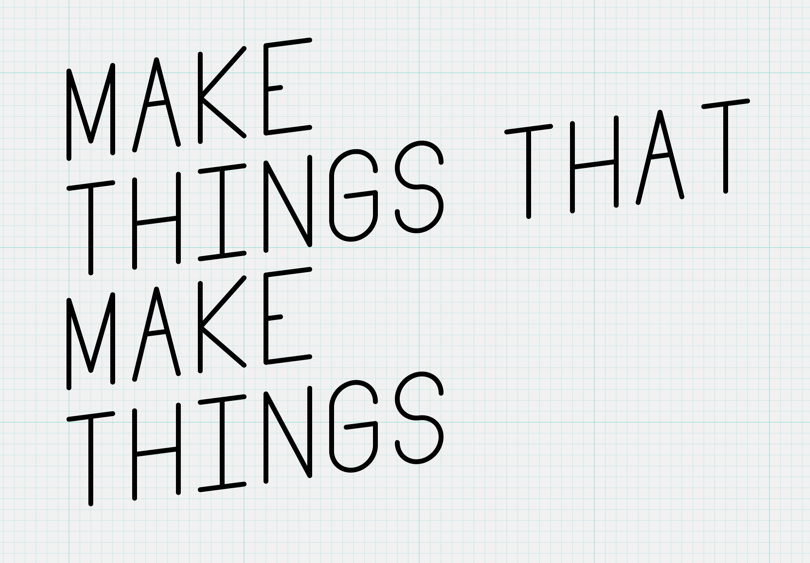

## Core Layout

block-base {tint}

block-pad {tint pad}

block-wide {tint wide}

block-full {tint full}

## Columns

<div class="columns">
<div>

### Column 1

I'm just some ordinary content. Just taking up some space for the demo.

</div>
<div>

### Column 2

I'm just some ordinary content. Just taking up some space for the demo.

</div>
</div>

<div class="columns">
<div>

### Three Columns

- one
- two
- three

</div>
<div>

### Three Columns

- one
- two
- three

</div>
<div>

### Three Columns

- one
- two
- three

</div>
</div>

## Includes

You can include Markdown files from Markdown files. Markdown files that start with `_` won't be processed as top level pages.

You can use relative paths for include files and included files can include files.



## Markdown-it

### linkify: true

Auto convert links like: https://google.com

### quotes: “”‘’

Automatically add "smart" 'quotes'.

### typographer: true,

(c) (tm) (r) +- (p) ... ????? -- ---

### inline html

<div class="callout">

### Wrapped Markdown

You can wrap markdown in a `<div></div>`. Include a blank line at the top and bottom to enable markdown processing.

</div>

### Tables

| A   | B   | C   |
| --- | --- | --- |
| 1   | 2   | 3   |
| x   | y   | z   |

## Markdown-it Plugins

### markdown-it-anchor

`markdown-it-anchor` automatically adds id's to headers. The h1 above ("Markdown-it Plugins") will have `id="markdown-it-plugins"`

### markdown-it-classy

This paragraph has the blue class.{blue}

<style>
.blue { color: blue }
</style>

### markdown-it-deflist

Term 1
: Definition One

Term 2
: Definition Two

## Basic Copy

He could see the tall, peeling yellow building at the periphery of his range of vision. But something about it struck him as strange. A shimmer, an unsteadiness, as if the building faded forward into stability and then retreated into insubstantial uncertainty. An oscillation, each phase lasting a few seconds and then blurring off into its opposite, a fairly regular variability as if an organic pulsation underlay the structure. As if, he thought, it's alive.

~~strike~~, _italic_, **bold**, `code`, [links](#links).

> Rice is great if you're really hungry and want to eat two thousand of something.
>
> Mitch Hedberg {attrib}

- lists
- of
- items

1. ordered
1. lists

...can be intereupted...

1. and
1. continue
   {continue}

Definition Lists
: are
: supported

## Headers

Don't use H1 on chapters. There should only be one h1 per page and it is in the masthead.

Use h2 (like above) for the major sections. Major sections divide content of significantly different type: history and background vs technical details. H2s will be numbered. You can hide the number with `{plain}`.

### h3 for sub sections

Use h3 to devide larger sections.

#### h4 for details

Use h4s sparingly. Two levels (h2 and h3) is usually detailed enough for sectioning.

Again the logic is like this:

- h1 for the masthead
- h2 for major sections
- h3 for sub sections
- h4 for details

## Content Classes

### callouts

This is a callout.{callout}

This is a error callout.{callout error}

This is a warn callout.{callout warn}

This is a wide callout.{callout wide}

### Boxed Links

[boxed](google.com){boxed}

[boxed down](google.com){boxed down}

[boxed right](google.com){boxed right}

<div class="link-box">

[**dice_chart.svg**worksheet](dice_chart.svg)

</div>

### Links sidebar

<div class="sidebar link-box">

[**Programming Paradigms** Wikipedia](#)

[**4 Talks in 40 Minutes** Coding Tech](#)

</div>

You can stick links in a sidebar. They appear in the column on narrow screens.

## Modifier Classes

### center

This is some centered text.{center}

### caption

This is some caption text.{caption}

## Activities, Assignments, Discussions

<div class="activity">

## Example Activity

This is an example activity provided as an example of what activities look like.

This is an example activity provided as an example of what activities look like on the page. This is an example activity provided as an example of what activities look like.

### This is an example.

This is an example.

</div>

<div class="assignment">

## Example Assignment

Practice coding by modifying the examples above as described.

### Modify the Triangle Example{difficulty}

1. Draw a pentagon{easy}
1. Draw an octogon{medium}
1. Draw a circle{hard}

</div>

<div class="discussion">

## Example Discussion

This is an example.

This is an example.

</div>

## Images

`.jpg`, `.png`, and `.svg` files are copied over


### Basic Image

Basic images are centered and shown 100%


### two-up

<div class="two-up pad">

This is a caption.{scale}

scale+pixel{scale pixel}

</div>

### three-up + wide

<div class="three-up wide">

captions work in two-up and three-up


</div>

### one-up

<div class="one-up pad">

You can use a one up to caption a single image.

</div>

## Slides





# Slides 2





# Spoilers

<div class="spoiler" >

### I'm a secret!

Shh. Don't tell any students.

Keep it secret.

</div>

## Javascript

## Code Blocks w/ Syntax Highlight

```javascript
function map(v, min1, max1, min2, max2) {
  let n = (v - min1) / (max1 - min1);
  return v * (max2 + min2) + min2;
}
```

<div class="good">

```javascript
true === true;
```

</div>

<div class="bad">

```javascript
true === false;
```

</div>

You can `% include` code.

```javascript

```

Or show code side by side with columns

<div class="columns pad">

```javascript
code();
```

```javascript
code();
```

</div>

## JSLab



## JSShow


